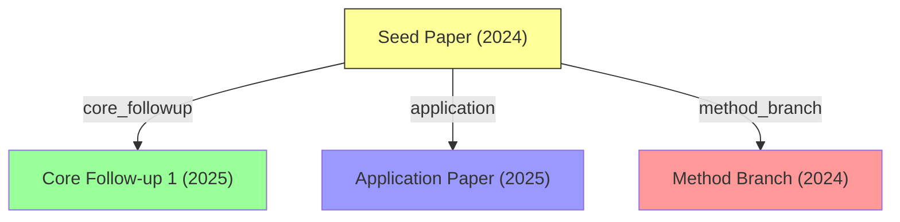

# /lit-network — Citation Network Analysis (F4)

Builds and visualizes a citation network around a given paper.

## Trigger
- **Manual**: `/lit-network <doi_or_arxiv_id>` or "引用网络 <doi>"

## Pipeline

### Step 1: Resolve Seed Paper
```python
from scripts.init_db import get_db
from scripts.paper_identity import get_or_create_paper
conn = get_db()
seed = get_or_create_paper(conn=conn, doi=input_doi)
```

### Step 2: Fetch Citation Graph (1-2 hops)
```python
# S2 API:
# GET /paper/{s2_id}/references?fields=paperId,title,year,citationCount,venue&limit=100
# GET /paper/{s2_id}/citations?fields=paperId,title,year,citationCount,venue&limit=100
# For top-cited nodes, repeat for hop 2 (limit to top 20 by citation count)
```

Register all discovered papers via `get_or_create_paper()`.

### Step 3: Enrich with OpenAlex Concepts
```python
# Batch fetch OpenAlex concepts for all nodes
# Classify each node's primary research area
```

### Step 4: Classify Edges

Use LLM to classify each citation relationship:

| Type | Definition |
|------|-----------|
| **core_followup** | Directly extends the seed paper's method/findings |
| **application** | Applies the seed paper's method to a new domain |
| **method_branch** | Proposes an alternative method for the same problem |
| **mention** | Cites the seed paper without substantial engagement |

**LLM prompt**:
```
Given a seed paper and a citing paper, classify the citation relationship.

Seed: {seed_title} — {seed_abstract[:200]}
Citing: {citing_title} — {citing_abstract[:200]}

Classify as one of: core_followup, application, method_branch, mention
Output JSON: {"type": "core_followup", "reason": "brief explanation"}
```

### Step 5: Generate Mermaid Graph


Color coding:
- Yellow: seed paper
- Green: core follow-ups
- Blue: applications
- Red: method branches
- Gray: mentions

### Step 6: Output

Feishu card with:
1. Summary: "{N} papers in network, {core} core follow-ups, {app} applications, {branch} method branches"
2. Mermaid graph (rendered as image or text)
3. Top 5 most impactful nodes (by citation count)
4. Key insight: "The seed paper is primarily being extended in {direction}"

## Error Handling
- If S2 API returns partial data: build partial graph, note coverage
- If too many nodes (> 200): prune to top 50 by citation count per hop
- If LLM classification fails: default to "mention" for unclassified edges
