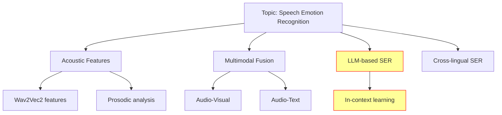

# /lit-panorama — Field Panorama (F5)

Generates a comprehensive overview of a research field.

## Trigger
- **Manual**: `/lit-panorama <topic>` or "领域全景 <topic>"

## Phase
v3 — requires stable F1/F4 infrastructure first.

## Pipeline

### Step 1: Fetch Field Data
```python
from scripts.init_db import get_db
from scripts.fetch_papers import fetch_openalex_by_dois
from scripts.paper_identity import get_or_create_paper

conn = get_db()

# OpenAlex: search works by concept/topic
# GET /works?filter=concepts.id:{concept_id}&sort=cited_by_count:desc&per_page=200
# Also: GET /concepts/{id} to get concept hierarchy
# Fetch top 300 papers in last 3 years
```

### Step 2: Build Taxonomy
```python
# From OpenAlex concept hierarchy:
# Level 0: broad field (e.g., "Computer Science")
# Level 1: subfield (e.g., "Natural Language Processing")
# Level 2: topic (e.g., "Sentiment Analysis")
# Level 3: subtopic (e.g., "Multimodal Sentiment")

# Build tree structure from concept relationships
```

### Step 3: Overlay User's Active Projects
```python
from scripts.config import load_profile
profile = load_profile()

# Map each active_project's keywords to concept tree branches
# Highlight branches where user has active work
```

### Step 4: Per-Branch Analysis

For each branch in the taxonomy:
1. **Top 3 representative papers** (by citation count, last 3 years)
2. **Active authors/groups** (by publication count + citation impact)
3. **Publication trend** (year-over-year count: growing/stable/declining)

### Step 5: Generate Concept Map

Mermaid graph:


Yellow + red border = user's active project areas.

### Step 6: Output

Feishu card with:
1. Field overview: "{N} papers, {M} concepts, top venues: {venues}"
2. Concept map (Mermaid rendered as image)
3. Per-branch summary table
4. "Your position": which branches the user's projects overlap with
5. Emerging branches: concepts with Z-score > 2 in recent trends

## Error Handling
- If topic too broad (> 10k papers): narrow to top 300 by citation
- If OpenAlex concept hierarchy incomplete: build from paper clustering
- If LLM summarization fails: provide raw statistics only
